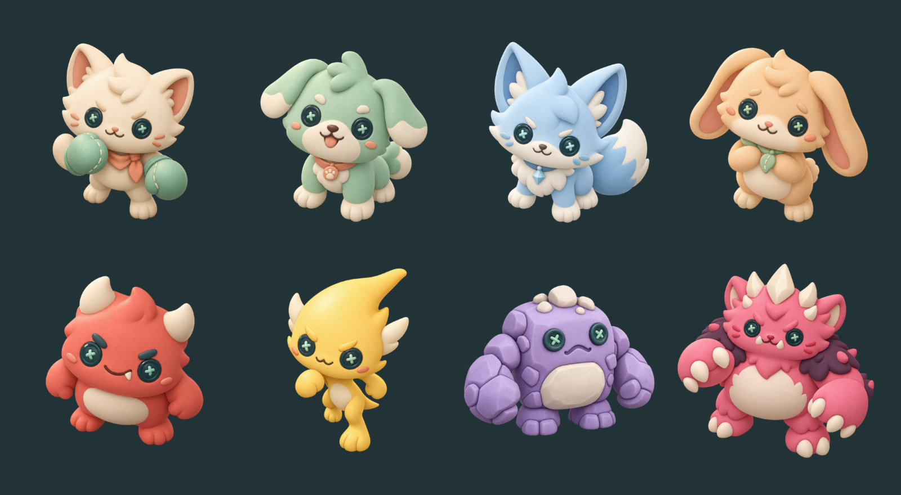

# PET THEM!

**귀여우면 쓰다듬고, 덤비면 두드려라.**

가로형 모바일 생존 액션 로그라이트와 게임 밸런스 실험실 프로젝트.
플레이어는 직접 펀치를 날리고, 펫 Mochi는 자동으로 적을 공격합니다.

## 현재 구현

- 60 Hz 공통 C# 전투 코어: 이동, 방향 펀치, 밀치기, 자동 공격 펫, 추격형·돌진형 적, 웨이브, 승리·패배·중도 종료.
- Unity 프로토타입 소스: 모바일 멀티터치, PC 입력, 시작·일시정지·재시작, 새 캐릭터·숲 배경 아트.
- 외부 JSON 밸런스 설정과 JSONL 실행 기록.
- 전투 코어를 UnityEngine 없이 실행하는 핵심 규칙 검증 도구 (tools/CoreChecks).
- 캐릭터 8종과 배경 PNG: 종류마다 다른 실루엣, 생물 하나당 렌더러 하나 (game/Assets/Scripts/Art.cs).

**게임 완성을 먼저 진행하고 MCP 개발은 그 뒤에 재개합니다.** 기존 프로토타입은 Unity 컴파일·APK 빌드와 사용자 화면 확인을 마쳤습니다. 새 강화 UI·무기 UI와 0.3.0 APK·실기기는 아직 검증 전입니다.
0.2.0에서 처치 XP와 3택1 강화, 0.3.0에서 주무기 3종, 0.4.0에서 보스와 코인 보상, 0.5.0에서 펫 3종, 0.6.0에서 상점과 저장, 0.7.0에서 한국어 UI와 다국어 구조, 0.8.0에서 코드 생성 스프라이트, 0.9.0에서 활 당기기 조작, 0.11.0에서 강화 22종과 빌드 화면을 추가했습니다. 스테이지 확장과 튜토리얼이 다음 단계입니다. MCP 도구 10개와 기본 HTML 보고서는 별도 실험실 저장소에 구현되어 있습니다.

### 언어

화면에 나오는 모든 문자열은 `game/Assets/Scripts/Texts.cs` 한 곳에 있습니다. 언어를 추가하려면 이 파일에 갈래 하나만 넣으면 되고, 화면 코드는 건드리지 않습니다. 기본값은 기기 언어를 따르며 시작 화면에서 한국어 ↔ English를 즉시 전환할 수 있습니다.

한글은 IMGUI 기본 폰트에 글리프가 없어 OS 폰트로 대체합니다. 폰트 파일은 라이선스 문제로 저장소에 포함하지 않았습니다.

### 그래픽

0.10.0부터 장난감 질감의 캐릭터 8종과 숲속 풀밭 배경을 사용합니다.
내장 image_gen으로 제작한 2D 스프라이트이며 3D 메시나 리깅 에셋은 아닙니다.
캐릭터·펫·몬스터는 게임 화면에, 펫 초상화는 상점과 시작 화면에도 적용했습니다.

이미지: `game/Assets/Resources/Art/Clay/`. [아트 제작·프롬프트·검증](docs/art-direction.md).
Unity 임포트·렌더링을 확인했습니다. 새 아트의 실제 Play·모바일 성능 확인은 남아 있습니다.
기존 코드 생성 이미지는 에셋이 누락된 경우의 대체용으로 유지합니다.

### 판 밖 성장

시작할 때는 Mochi만 있습니다. 판이 끝나면 코인이 쌓이고, 상점에서 Bori(320)와 Coco(520)를 해금합니다.
코인은 `Application.persistentDataPath/profile.json`에 저장되며, **중도 종료한 판은 보상이 없습니다.**

### 펫 3종

무기와 함께 판 시작 전에 고릅니다. 강화 선택지도 고른 펫에 맞춰 나옵니다.

| 펫 | 역할 | 피해 | 고유 효과 |
| --- | --- | --- | --- |
| Mochi | 공격형 | 100% | 없음. 가장 세게 때립니다 |
| Bori | 제어형 | 45% | 문 적을 감속시키고 밀칩니다 |
| Coco | 지원형 | 30% | 주기적으로 회복하고 받는 접촉 피해를 줄입니다 |

### 한 판의 흐름

3분 생존이 기본이고, **120초에 보스가 등장**합니다. 보스를 잡으면 시간이 남아도 그 자리에서 승리합니다.
잡지 못한 채 3분을 버텨도 승리지만 기록에는 다른 결과(`survived` / `boss_down`)로 남습니다.
처치 수·보스 처치·생존 시간으로 코인을 받습니다. 모은 코인으로 상점에서 펫을 해금합니다.

적은 추격형(코랄) / 돌진형(골드) / **브루트(퍼플, 느리지만 단단하고 세게 때림)** 3종과 보스(핑크)입니다.

### 주무기 3종

판 시작 전에 하나를 고르고, 그 판 내내 그 무기를 강화합니다.

| 무기 | 조작 | 성격 |
| --- | --- | --- |
| 펀치 | 탭으로 휘두름, 드래그로 조준 | 근거리 범위 + 밀치기. 탈출구 확보 |
| 화살 | **활처럼 뒤로 당겼다 놓기**. 당긴 반대로 날아감 | 관통. 많이 당길수록 세고 빠름 |
| 레이저 | 누르고 있으면 지속 피해 | 쿨다운 대신 **열 게이지**. 100이 되면 완전히 식을 때까지 잠김 |

강화 선택지는 고른 무기에만 나옵니다. 레이저 판에서 펀치 강화는 제시되지 않습니다.
Play 모드 확인 순서와 기록 진단은 [docs/playtest.md](docs/playtest.md)를 참고하세요.

## Unity 실행

1. Unity Hub에서 Unity **6000.3.24f1**과 Android Build Support / SDK & NDK / OpenJDK를 설치합니다.
2. Unity 계정으로 로그인하고 사용할 수 있는 라이선스를 활성화합니다.
3. 저장소 안의 **game** 폴더를 Unity Hub 프로젝트로 추가합니다.
4. 에디터 메뉴 **PET THEM > Create or open prototype scene**을 실행합니다.
5. Play를 누릅니다. Game 뷰는 16:9 가로형을 권장합니다.

| 환경 | 이동 | 공격 |
| --- | --- | --- |
| 모바일 | 왼쪽 영역에서 드래그 | 오른쪽 탭으로 자동 조준 펀치, 드래그 후 해제로 방향 지정 |
| PC | WASD 또는 방향키 | 마우스 위치 조준 + 클릭, SPACE는 자동 조준 |

일시정지는 우측 상단 버튼 또는 Escape입니다. 앱이 포커스를 잃으면 자동으로 일시정지합니다.
Android 개발 APK: **PET THEM > Build Android development APK**. 개발 빌드이며 스토어 배포용 서명은 포함하지 않습니다.

## Unity 없이 전투 규칙 검증

.NET SDK 10.0.400 이상 같은 패치 계열이 필요합니다. 저장소 루트에서 실행합니다.

~~~powershell
powershell -NoProfile -ExecutionPolicy Bypass -File scripts/check.ps1
~~~

전투·성장·무기·펫·저장·번역 검사 36개를 실행합니다.

## 밸런스 실험실은 별도 저장소입니다

봇 시뮬레이터, MCP 서버, 기록 분석, HTML 보고서 생성기는
[jjjGi/pet-them-balance-lab](https://github.com/jjjGi/pet-them-balance-lab) (비공개)에 있습니다.

그 저장소는 이 저장소의 전투 코어와 밸런스 설정을 **복사하지 않고 참조**합니다.
두 폴더를 나란히 두거나 `PETTHEM_GAME_ROOT` 환경 변수로 이 저장소의 경로를 알려주면 됩니다.

~~~powershell
# 실험실 저장소에서
dotnet run --project src/Simulator -c Release -- --runs 5 --seed 42
~~~

봇은 정해진 정책으로 이동하며 자동 조준 펀치를 반복합니다. **실제 사람의 실력·조작감·재미를 측정하는 도구가 아닙니다.**

## 밸런스 설정과 기록

- 설정: game/Assets/Resources/balance-default.json
- 공통 전투 소스: packages/com.petthem.combat-core/Runtime
- 실제 플레이 기록: Unity Application.persistentDataPath 아래 runs/
- Windows 기본 기록 위치: %USERPROFILE%/AppData/LocalLow/PetThem/PET THEM!/runs
- 실행 종료 화면에도 기록 경로를 표시합니다.
- 로그 스키마: [docs/telemetry.md](docs/telemetry.md)

프로토타입 기록은 로컬에만 저장합니다. 서버로 전송하지 않습니다.

## 이어서 개발하기

[PROJECT.md](PROJECT.md)에 합의한 기획, 단계별 완료 기준, MCP 도구와 Create_Balance_Report 상세 요구사항이 있습니다.
[AGENTS.md](AGENTS.md)에 검증·문서 갱신·자동 커밋과 푸시 지침이 있습니다.
밸런스 실험실 쪽 작업은 [jjjGi/pet-them-balance-lab](https://github.com/jjjGi/pet-them-balance-lab)의 README와 AGENTS.md를 따릅니다.
다른 대화나 다른 에이전트로 이어받을 때는 [docs/handoff.md](docs/handoff.md)를 먼저 읽습니다.
