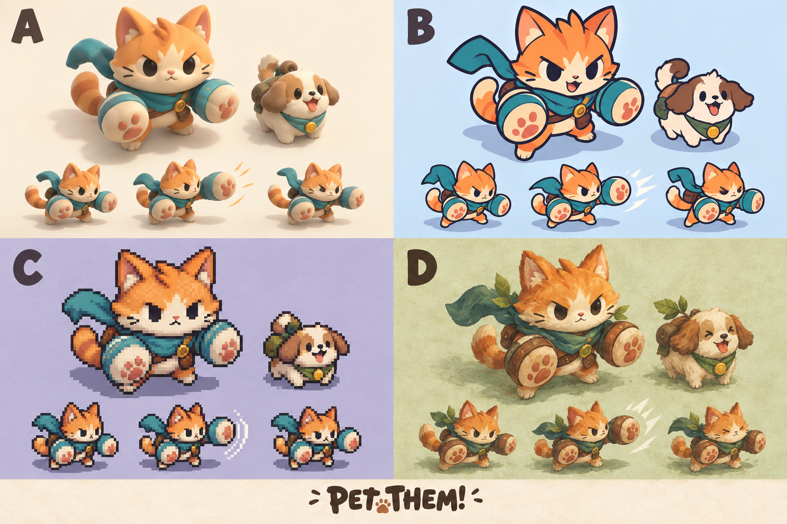

# 캐릭터 아트 방향 비교 (2026-09-26)

| 시안 | 방향 | 애니메이션 제작 방향 제안 |
| --- | --- | --- |
| A | 말랑한 클레이·장난감 | 몸통 눌림과 튀어 오름, 큰 앞발 반동 |
| B | 외곽선이 선명한 2D 카툰 | 과장된 준비 자세와 빠른 타격, 표정 변화 |
| C | 픽셀 아트 | 제한된 프레임으로 강한 포즈 변화 |
| D | 동화풍 숲 탐험가 | 망토·귀·꼬리의 부드러운 후속 움직임 |

비교용 생성 이미지이며 게임 아트는 아직 교체하지 않았다. 아래 작은 그림은 준비/타격/회수 자세 시안이다. 스프라이트 시트나 재생 가능한 애니메이션이 아니다. 실제 64px 가독성·프레임 연결은 제작 후 따로 확인해야 한다.

생성 도구: 내장 image_gen (imagegen 스킬), CLI 사용 안 함. 선택 대기.

## 최종 생성 프롬프트

Use case: stylized-concept. Create one polished art-direction comparison board for an original mobile top-down action game PET THEM! The user is choosing a new character art direction, not final assets. Landscape board, clear 2x2 quadrants labeled only A, B, C, D in large legible letters. SAME recognizable orange-and-cream cat adventurer with teal scarf and oversized punching mitts, SAME small round dog companion in every quadrant, consistent three-quarter top-down game camera and silhouette sizes so comparison is fair. A: premium soft clay/vinyl toy, tactile rounded shapes, squash and stretch, warm cream background. B: bold 2D cartoon cel art, confident thick dark outlines, vivid restrained palette, expressive fierce cute cat, pale blue background. C: beautiful crisp carefully authored pixel art sprites, coherent pixel grid, no blurry pixels, retro action RPG, muted lavender background. D: storybook woodland adventurer, warm painterly gouache, leaf accessories on scarf, rustic charming dog, parchment green background. In each quadrant show a large idle character and companion, then a smaller three-pose strip showing anticipation, forward punch, recovery; animation poses are clearly different and readable. Strong personality, exaggerated simple shapes readable at 64px, eyes and limbs coherent, no human characters, no copied franchise designs. Clean spacious comparison layout, minimal background, no scenery distracting from characters, no text except A B C D and small title PET THEM!.
