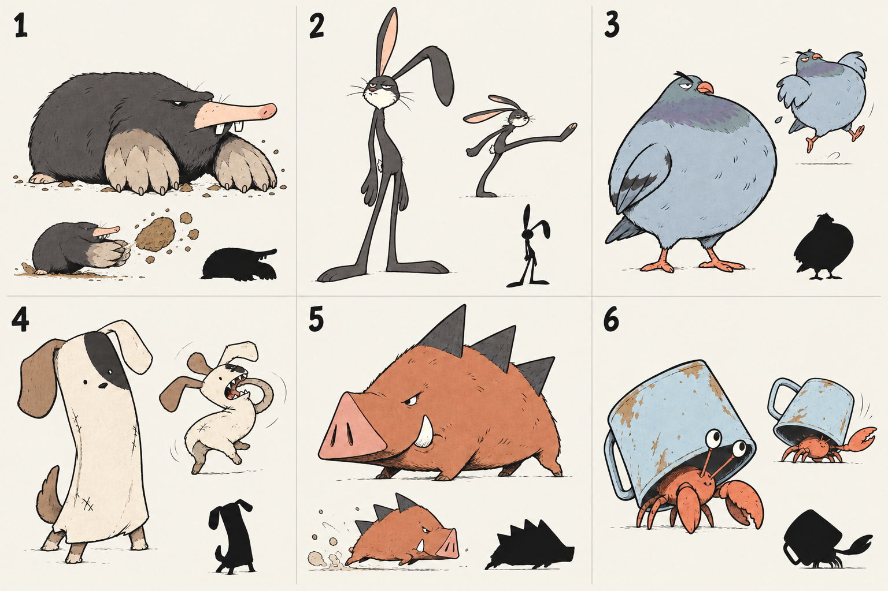

# 캐릭터 자체의 새 디자인 탐색

**2026-09-26 사용자 결정: 이 6종은 몬스터 콘셉트로 채택.** 플레이어는 별도로 다양하게 탐색한다. 몬스터의 실제 게임 스프라이트·애니메이션·전투 역할 연결은 아직 구현하지 않았다.

기존 고양이와 그림체 4종 비교는 사용자에게 거절됐다. 이번에는 동일한 단순한 표현 방식에서 캐릭터의 종·체형·얼굴·성격·행동을 바꾼다.

| 번호 | 디자인 의도 | 특유의 행동 제안 |
| --- | --- | --- |
| 1 | 낮고 네모난 무뚝뚝한 두더지 | 흙을 파서 덩어리째 던짐 |
| 2 | 길쭉하고 시큰둥한 토끼 | 긴 다리로 탄력 있는 발차기 |
| 3 | 가슴만 잔뜩 부푼 건방진 비둘기 | 온몸으로 가슴 들이받기 |
| 4 | 귀가 짝짝이인 헝겊 강아지 | 수건처럼 몸을 휘두름 |
| 5 | 쐐기 모양의 성질 급한 멧돼지 | 뒤뚱거리며 머리부터 돌진 |
| 6 | 거대한 양철 컵을 진 소라게 | 컵 아래 숨었다 집게만 내밈 |

사용자가 몬스터 방향으로 승인한 콘셉트다. 실제 게임 크기의 가독성과 동작 연결은 미검증. 작은 동작 그림은 애니메이션 제작 의도를 설명하는 시안이며 재생 가능한 에셋이 아니다. 게임 그림은 교체하지 않았다.

생성 도구: 내장 image_gen, 기존 대화에서 읽은 imagegen 스킬 적용. CLI 사용 안 함.

## 최종 생성 프롬프트

생성 후 첫 결과의 어두운 배경 때문에 얼굴과 실루엣을 비교하기 어려워 배경·가독성 수정을 추가 요청했다.

### 배경 수정 프롬프트

undefined

### 최초 디자인 생성 프롬프트

Use case: stylized-concept. Asset type: early character DESIGN exploration board for an original top-down action game, NOT a rendering-style comparison. The previous generic orange baby-eyed cat with scarf and boxing mitts was rejected as bland and AI-looking. Start completely fresh. Create SIX fundamentally different playable creature protagonist candidates on a spacious off-white 3-column by 2-row landscape sheet. Labels only 1, 2, 3, 4, 5, 6. Each cell contains one large personality-filled full-body standing pose, one small action pose of that SAME design, and one tiny solid black silhouette. Keep design consistent within each cell. All six use the SAME restrained confident hand-inked flat-color visual language, slightly imperfect expressive lines, two or three colors each, no gradients, no rendering gloss, no detailed backgrounds. Prioritize graphic shape design, comedic attitude, imperfect asymmetry, recognizable proportions, appealing oddness, and expressive gesture over conventional cuteness. Eyes mostly small dots or narrow slits, not enormous glossy baby eyes. No scarves, gloves, armor outfits, backpacks, belts, shiny ornaments, generic fantasy gear, brand references, watermarks, or generated lettering beyond the six numbers.

1: A stubborn low rectangular soot-colored mole, nearly no visible neck, long blunt peach snout, ridiculously broad natural spade-shaped forepaws, pin-sized eyes almost hidden under brow, one upper tooth. Body is a heavy horizontal brick, feet tiny. Stoic groundskeeper energy. Small action: burrows snout-first and flings a huge dirt clod using bare forepaws.
2: A very tall absurdly thin charcoal hare, cream muzzle, long rubber-hose legs and two wildly unequal ears (one straight, one hanging like a bent antenna). Tired skeptical half-lidded eyes, slight slouch, minimal anatomy, one clean silhouette. Small action: elastic sideways kick with ears dragging behind. Cool and unimpressed, not babyish.
3: A squat pear-shaped dusty blue city pigeon, tiny head sunk into a huge proud puffed breast, short coral feet and a short blunt beak, one sharply slanted eyebrow, undersized folded wings. An overconfident street pest with a swagger. Small action: ridiculous full-body chest bump, feet airborne.
4: A cream rag-dog creature with a long rectangular floppy cloth body, two mismatched flap ears, tiny black stitched-looking eyes, no clothing because the body itself is soft rag, a single large black patch crossing one eye, short crooked legs. Looks shy until ferocious. Small action: body whips around like a towel while biting its own tail. Very minimal fabric marks, no ornate texture.
5: A terracotta boar shaped like a forward-pointing blunt wedge, huge flat triangular snout, tiny rear legs, three big blunt charcoal back spikes, small angry eyes, one chipped ivory tusk. Compact chunky ugly-cute bruiser with zero accessories. Small action: skids into a head-first charge with rear feet struggling to catch up.
6: A tiny rust-red hermit crab dragging one comically oversized dented pale blue tin cup as its shell, two unequal claws and long single-jointed eye stalks, crab stays visibly small relative to cup. A nervous scavenger who accidentally carries a tank. Small action: hides underneath the cup while thrusting one claw out, cup tilted. Cup is the only prop.

No shared cat face, no interchangeable round mascots. Deliberately vary head-to-body ratios and weight distribution. The small poses show personality and intended animation, not final animation frames. Clear separation, generous negative space, publication-quality character design sketchbook layout.
