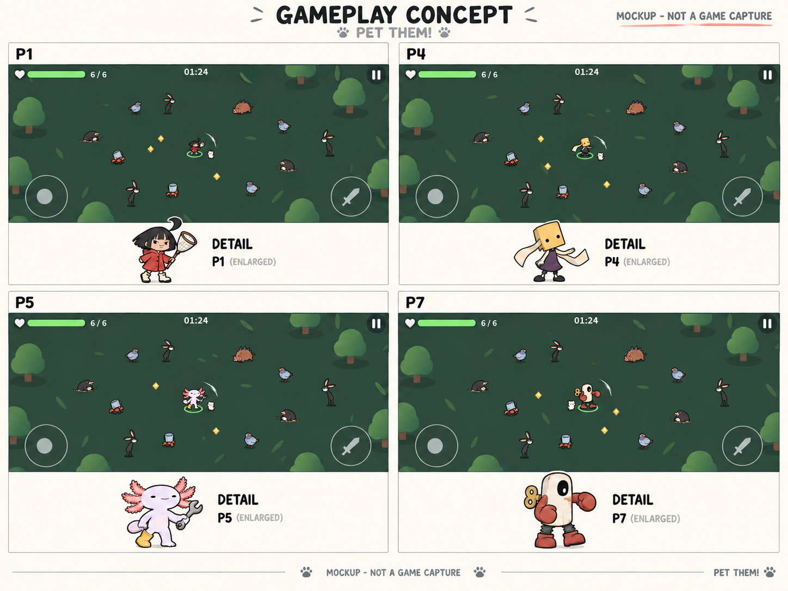

# 모바일 플레이 화면에서의 캐릭터 비교

2026-09-28. 사용자 질문: "모바일에서 어떻게 보이려나? 플레이할 땐 어떻게 보여?".

**이 이미지는 image_gen으로 만든 예상 시안이다. 실제 게임 캡처, 정확한 픽셀 배치, 구현된 HUD, 성능 검증 결과가 아니다.** 캐릭터 선택 전 전투 속 색과 형태를 비교하는 용도다. 아래 별도 캐릭터 그림은 확대도다.

## 현재 코드에서 계산한 크기

- `PrototypeGame.Update`: 이동형 맵에서 카메라 `orthographicSize = Max(7, 11 / aspect)`.
- 16:9에서는 카메라 세로 범위가 14월드 단위다.
- `Art.LoadArtwork`는 캐릭터 전체 텍스처를 높이 1월드 단위의 스프라이트로 만든다. 플레이어 기본 배율 1.
- 중립 자세의 전체 그림 캔버스: 화면 높이 ÷ 14. 720px이면 약 51px, 1080px이면 약 77px.
- 몸체에 포함되지 않는 투명 여백, 호흡·공격 배율은 별도로 반영된다. 실제 휴대폰 물리 크기를 실측한 수치가 아니다.
- 기존 Unity 렌더 `experiments/travel-preview/map-0.png`의 중앙 고양이가 현재 크기를 보여준다. 이 파일 역시 합성 장면 렌더이며 실제 전투 플레이 캡처는 아니다.

## 디자인 판단 (아직 가설)

- P1: 빨간 우비가 배경에서 구분될 가능성. 얼굴·그물망 선은 축소하면 사라진다.
- P4: 노란 사각 가면은 작은 크기에도 형태가 단순하다. 가느다란 팔다리는 스프라이트 제작 때 굵기 조절이 필요하다.
- P5: 넓은 머리와 아가미가 외곽 형태를 만든다. 아가미의 작은 가지는 몇 개의 큰 형태로 줄일 필요가 있다.
- P7: 밝은 몸통과 붉은 팔이 분리돼 보인다. 태엽·관절의 작은 디테일은 단순화해야 한다.

게임 구현 전에는 같은 카메라에서 실제 스프라이트를 렌더하여 움직임, 적 무리와의 구분, 터치 조작 중 가림을 검증해야 한다. 아직 최종 캐릭터 선택이나 게임 그림 교체는 하지 않았다.

## 생성 과정의 한계

첫 생성에서는 실제 설정에 비해 전투 캐릭터가 크게 나왔다. 이를 실제 플레이 크기로 소개하지 않고, 전투 영역의 캐릭터 축소를 추가 요청했다. 생성 이미지의 배치·배율을 코드에서 계산한 정확한 수치로 취급하지 않는다. 확대도의 고정 배율 표기도 제거 요청했다.

축소 수정본에서도 후보별 크기가 정확히 같지 않다(P5/P7이 상대적으로 큼). 따라서 이 그림은 화면 연출과 색·형태를 검토하는 자료이며 정량적인 크기 비교 자료가 아니다. 정확한 현재 크기는 위 코드 계산과 기존 Unity 렌더를 기준으로 한다.

## 축소 수정 프롬프트

Edit this four-panel mobile gameplay concept comparison board. Keep the entire board layout, labels P1 P4 P5 P7, game backgrounds, trees, UI, header and footer exactly as they are. Correct ONE issue: the heroes and enemies inside the four green gameplay viewports are much too large. In EACH gameplay viewport SHRINK EVERY ACTOR (central playable character, pet and each enemy) TO 45 PERCENT OF ITS CURRENT WIDTH AND HEIGHT, keeping each actor centered on its existing ground/contact position. This reduction is crucial and must be visually obvious. The hero's total height in the green viewport should be approximately 7 to 8 percent of that viewport's height, about 22 pixels if viewport is 290px high, NOT the current 50-60px. Shrink associated attack slash and selection ellipse with hero. Leave tree scenery, HUD and joystick unchanged. Carefully reconstruct green ground behind the smaller characters. Keep the LARGE isolated character previews below each viewport at their current large size, since those are magnifications. Replace all four '3x DETAIL' labels with simply 'DETAIL' because the magnification is no longer 3x. Preserve clear 'MOCKUP - NOT A GAME CAPTURE' labels. Do not change any character identity or art style, do not add actors, do not crop or zoom. This is intended to demonstrate how small mobile gameplay sprites actually appear.

## 최초 생성 프롬프트

Use case: ui-mockup. Create a clear MOBILE GAMEPLAY CHARACTER READABILITY COMPARISON board for PET THEM!, not a character portrait sheet. This is an illustrative mockup, not actual captured gameplay. Use four reference images: reference 1 is the P1-P4 protagonist design sheet; reference 2 is P5-P8 protagonist design sheet; reference 3 is approved monster design sheet; reference 4 is a real Unity forest render defining the camera distance, sparse map and small character scale. Preserve these character identities while simplifying detail for small sprites.

Layout: a landscape 2x2 comparison board, ideally 2048x1536. FOUR separate landscape 16:9 mobile GAME VIEWPORTS, arranged two by two, each with a thin light ivory title strip and a small separate footer for a clearly marked enlarged sprite. Label viewports exactly "P1", "P4", "P5", "P7". Title at top "GAMEPLAY CONCEPT". Footer of each: one isolated enlarged rendering of that viewport's hero, label "3x DETAIL"; this enlarged figure must be OUTSIDE the gameplay viewport and never mistaken for gameplay scale.

Inside EVERY viewport: same top-down orthographic forest map composition as reference 4: flat dark muted green ground, sparse simple softly shaped trees near edges, ample clear central ground. Same overhead camera, same enemies and action positions for fair comparison. Center the controlled hero. The hero's TOTAL HEIGHT INCLUDING HEAD AND FEET MUST BE ONLY ABOUT SEVEN PERCENT OF THAT VIEWPORT HEIGHT, just slightly taller than the tiny cat in reference 4. Do NOT make large showcase characters, do NOT zoom camera in. At this tiny size design reads through silhouette and dominant color, not face detail. Draw simplified thick crisp dark outlines with a thin warm light rim on hero only, flat shading, reduced texture. A small pale mint selection ellipse under the controlled hero. One tiny cream companion pet nearby (around half hero height). About twelve small enemies (approved mole, skinny rabbit, plump pigeon, boar and cup crab designs from reference 3) approaching from multiple directions, spread out; enemies same approximate height as hero, colors slightly less saturated. One short bright slash near hero and a few small yellow XP pickups, avoid obscuring the hero. This is a readable mobile action-survival game, not an isometric diorama or an illustration.

Minimal plausible mobile HUD inside each viewport: very thin dark top bar with green HP bar at left, "01:24" in center, simple pause icon right. Faint outlined virtual movement joystick at bottom left and faint outlined attack circle bottom right, same dimensions and positions in all four. No phone bezels, no hands, no giant buttons, no marketing decoration, no invented complicated menus. Keep HUD secondary.

P1 viewport hero: black bob hair/cowlick, brick-red raincoat triangular silhouette, cream boots, small butterfly net. Adapt reference 1 P1.
P4 viewport hero: large plain yellow rectangular paper mask with two dot eyes, dark plum narrow tunic, pale limbs; paper strip follows a short swing arc. Adapt reference 1 P4.
P5 viewport hero: pale lavender axolotl, broad head and distinct coral gills, yellow single boot, little wrench. Adapt reference 2 P5.
P7 viewport hero: upright cream rounded-rectangle wind-up tin robot with one offset dark oval eye, rust-red arms, broad feet. Adapt reference 2 P7.

Keep colors and proportions of each identified candidate recognizable. The aim is to honestly reveal how much detail disappears in mobile gameplay. Tiny hero in the battlefield plus labeled 3x detail inset below. Bright ivory margins, absolutely no smoky vignettes. Header or footer must also say "MOCKUP - NOT A GAME CAPTURE".
