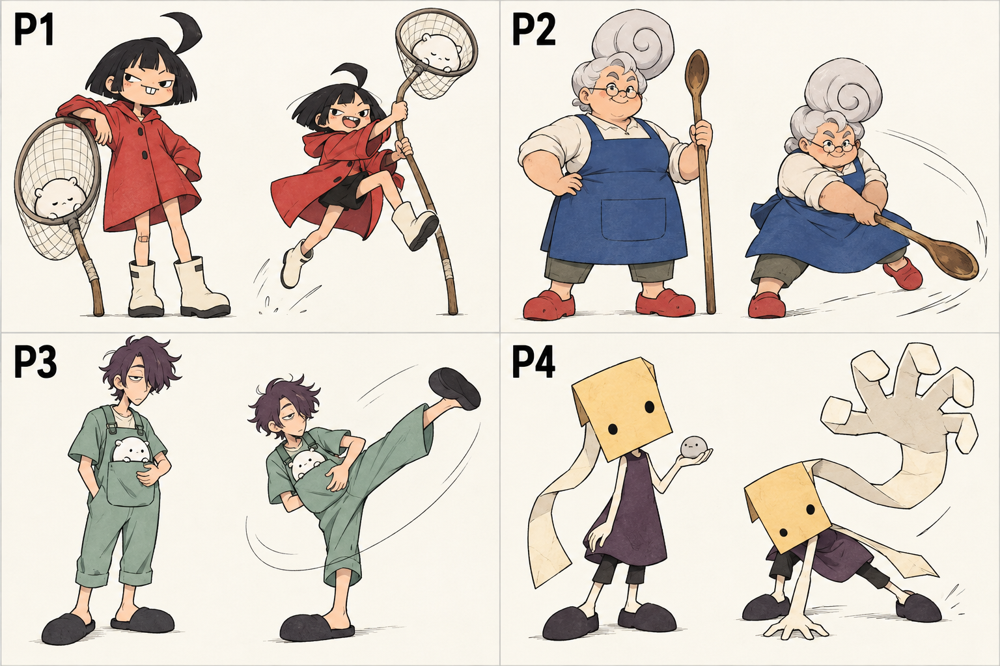
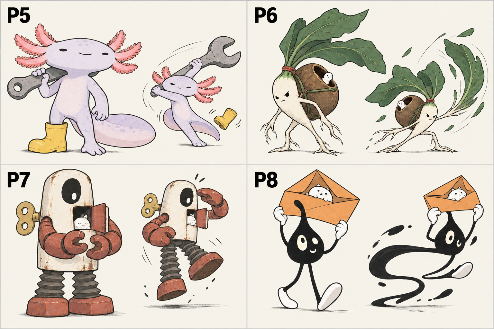

# 플레이어 캐릭터 탐색 — 8가지 정체성

**2026-09-28 선택:** 사용자가 P1·P4 같은 플레이어를 원한다고 답했다. 두 캐릭터를 유지하고 픽셀·각진 블록·모서리를 둥글린 블록·둥근 형태 등 표현 스타일을 비교한다. 최종 스타일과 실제 게임 에셋은 아직 미정이다.

2026-09-26 사용자 요청: 몬스터 6종을 승인하고 플레이어는 다양하고 창의적으로 새로 제안해 달라고 요청했다. 이전 몬스터 번호 1~6과 구분하기 위해 P1~P8을 사용한다.

## 사람과 가면

| 번호 | 콘셉트 | 조작·동작 의도 |
| --- | --- | --- |
| P1 | 빨간 우비의 꼬마 포획꾼 | 큰 잠자리채로 뛰어넘고 휘두름 |
| P2 | 힘 좋은 할머니 대장 | 나무 주걱으로 호쾌하게 공격 |
| P3 | 졸린 야간 펫 돌보미 | 주머니의 펫을 지키며 뜻밖의 발차기 |
| P4 | 종이 가면 방랑자 | 접힌 종이가 커다란 손으로 펼쳐짐 |

## 동물·식물·기계·추상 캐릭터

| 번호 | 콘셉트 | 조작·동작 의도 |
| --- | --- | --- |
| P5 | 외짝 장화의 우파루파 정비공 | 꼬리를 축으로 렌치 휘두르기 |
| P6 | 밤 껍질 집을 짊어진 무 모험가 | 잎을 펼쳐 공격하고 뿌리로 버팀 |
| P7 | 펫을 품은 태엽 구조 로봇 | 접힌 다리로 튀며 동료를 보호 |
| P8 | 잉크 방울 배달부 | 몸이 늘어나도 펫이 든 봉투는 지킴 |

기존 몬스터와 어울릴 수 있는 선·절제된 색을 유지하되 종·체형·성격·행동을 달리한 시안이다. 플레이어 선택은 아직 미정. 작은 동작 그림은 애니메이션 의도이며 실제 동작 에셋이 아니다. 정식 스프라이트, 작은 게임 화면의 가독성, 탑다운 방향별 동작, 무기 3종 연결은 후속 제작·검증이 필요하다. 게임 에셋 교체 없음.

도구: 내장 image_gen. imagegen 스킬 사용, CLI 사용 안 함. 아래는 실제 생성 프롬프트다.

## 모바일에서의 크기 (2026-09-28)

[전투 화면 예상 시안과 크기 계산](mobile-gameplay.md). 실제 게임 캡처와 구분해서 본다.

현재 기본 이동형 카메라는 16:9에서 orthographicSize=7이고 캐릭터 스프라이트 전체 캔버스 높이가 1월드 단위다. 따라서 중립 자세의 전체 캔버스는 화면 높이의 1/14, 720px 화면에서 약 51px다. 투명 여백과 자세 변형 때문에 실제 몸체의 높이는 달라진다. 이는 코드에서 계산한 값이며 휴대폰에서 실측한 값은 아니다.

시안의 작은 눈·옷 주름보다 P1 빨간 우비, P4 노란 사각 가면, P5 넓은 머리/아가미, P7 크림색 몸통 같은 큰 형태가 식별에 도움이 될 것으로 예상한다. 최종 선택 전 작은 크기의 실제 스프라이트와 전투 중 가독성을 확인해야 한다.

## 시트 2 배경 수정 프롬프트

Edit this sheet of FOUR playable character concepts labeled P5 P6 P7 P8. Preserve every character design and both poses in every cell, all proportions, props, facial expressions, line art and colors, exact panel layout and P5 P6 P7 P8 labels. Replace ONLY the dark smoky vignette/gradient backgrounds with a solid uniform opaque warm white (#F7F4EA) background throughout all four cells. No haze, no black patches, no atmospheric lighting. Make dark ink character P8 and labels fully legible against the pale background. Keep white highlights, original sketch outlines and muted colors. Do not redraw characters, do not add details, no new text. The entire sheet must have the appearance of a clear well-lit drawing on pale paper. Retain thin light-gray panel separators.

## 시트 1 프롬프트

Use case: stylized-concept. Original playable PROTAGONIST character design exploration for the mobile top-down action game PET THEM! The player commands companion pets against eccentric creature monsters. We are choosing character identity, not a rendering style. Create a landscape bright off-white character design sheet with FOUR spacious equal panels in a 2x2 grid. Each panel has one large full-body three-quarter front idle pose and one smaller extremely expressive action pose of the exact same character. Only the requested P-number labels, large crisp black, no other text. Consistent art language across panels: confident lively imperfect dark ink line, restrained flat colors with very subtle paper texture, appealing indie animation character design, expressive shape language, readable at small game scale. Completely uniform ivory background with thin pale gray separators. NO smoky backgrounds, vignette, gradients, dramatic lighting, detailed scenery, shiny 3D surfaces, oversized glossy baby eyes, orange cats, teal scarves, generic fantasy armor, belts/pouches overload, copied franchise characters. Have clear hands or hand-like limbs and feet, since player can wield different weapons. Distinct protagonists with agency, a strong pose and sympathetic personality, not enemy bestiary creatures. Dramatically varied proportions and silhouettes. No character should share another's face. Single memorable design idea per candidate, keep details economical. These are design/action thumbnails, not production sprites.
SHEET ONE, labels P1 P2 P3 P4.
P1 top-left: a short wiry human girl pet wrangler, blunt black bob cut with one huge sideways cowlick, tiny fierce eyes and one gap tooth, brick-red oversized raincoat cut above the knees, skinny bare legs and heavy cream rain boots. Her enormous circular butterfly net has a bent handle; one small sleepy plain white creature sits inside its mesh. Strong red trapezoid silhouette. Idle: cheeky lean on net. Small action: vaults with the net like a pole, coat opening in a bold shape. More scrappy neighborhood kid than anime heroine.
P2 top-right: a sturdy elderly human woman with a square silhouette, silver hair piled in a HUGE single spiral curl, tiny round spectacles low on nose, eyebrows projecting confidence, simple cobalt-blue sleeveless work apron over cream shirt, broad bare forearms, flat red gardening clogs. Only prop a long worn wooden spoon she carries like a general's baton. Idle: one hand firmly on hip, dry knowing smile. Small action: determined low forward swing with spoon, deceptively athletic grandma. Affectionate character design, no age mockery.
P3 bottom-left: a lanky young human male night-shift pet caretaker, messy aubergine hair falling over one eye, long sleepy oval face with narrow eyes, mint-green short-sleeved work overalls with one giant simple front pocket, too-short trouser legs, dark soft slippers. A plain round white pet peeks from pocket. Loose bent-knee silhouette, one hand always supporting the pet. Small action: unexpectedly elegant spinning kick while carefully holding pet steady. Understated deadpan personality.
P4 bottom-right: a small mysterious paper-mask wanderer, a very simple oversized rectangular warm-yellow paper mask with two OFF-CENTER black dot eye holes and one folded corner; under it a slim visible humanoid body in a dark plum knee-length sleeveless tunic, ivory thin arms, large simple flat shoes. One long strip of blank paper attached to mask trails sideways, no writing, no religious insignia. Idle: curious head tilt, one hand offering a tiny plain pebble pet. Small action: paper strip unfolds into a huge friendly grasping hand while body crouches. Abstract but endearing, mask is expressive through tilt and creases.

## 시트 2 프롬프트

Use case: stylized-concept. Original playable PROTAGONIST character design exploration for the mobile top-down action game PET THEM! The player commands companion pets against eccentric creature monsters. We are choosing character identity, not a rendering style. Create a landscape bright off-white character design sheet with FOUR spacious equal panels in a 2x2 grid. Each panel has one large full-body three-quarter front idle pose and one smaller extremely expressive action pose of the exact same character. Only the requested P-number labels, large crisp black, no other text. Consistent art language across panels: confident lively imperfect dark ink line, restrained flat colors with very subtle paper texture, appealing indie animation character design, expressive shape language, readable at small game scale. Completely uniform ivory background with thin pale gray separators. NO smoky backgrounds, vignette, gradients, dramatic lighting, detailed scenery, shiny 3D surfaces, oversized glossy baby eyes, orange cats, teal scarves, generic fantasy armor, belts/pouches overload, copied franchise characters. Have clear hands or hand-like limbs and feet, since player can wield different weapons. Distinct protagonists with agency, a strong pose and sympathetic personality, not enemy bestiary creatures. Dramatically varied proportions and silhouettes. No character should share another's face. Single memorable design idea per candidate, keep details economical. These are design/action thumbnails, not production sprites.
SHEET TWO, labels P5 P6 P7 P8. These should be lovable unusual controllable heroes, not generic mascots.
P5 top-left: an upright pale lavender axolotl mechanic, broad low head with exactly THREE bold coral gill branches on each side, tiny horizontal eyes, tiny relaxed smile, long broad paddle tail, short sturdy two legs and dexterous small arms. Wears only one simple oversized yellow rubber boot on one foot, other foot bare. Carries a single oversized open-end wrench, the jaw echoes the head silhouette. Idle: wrench on shoulder, cheerfully unbothered. Small action: pivots on tail to swing wrench, boot flies a little loose. Strong horizontal gills silhouette, no glossy kawaii face.
P6 top-right: a tiny living ivory radish wanderer with an elongated tapering root body, two branching root legs and long root arms, three huge angular dark green leaves swept backward like windswept hair, very small stubborn black eyes and a simple determined mouth. A single thin red elastic band ties the leaf stems; no clothing. A large round chestnut shell strapped on back is a hollow shelter for a tiny white worm pet, visible peeking out. Idle: leans forward under oversized shell with resolute attitude. Small action: leaf hair fans into a sweeping fan strike while roots brace. It must feel brave and springy, not a food logo.
P7 bottom-left: a battered wind-up tin toy rescuer, tall narrow rounded-rectangle cream torso/head in one piece, a single large OFFSET dark oval eye window with one expressive small white pupil, thick rust-red hinged arms, two very wide short accordion feet, small brass winding key sticking horizontally from its back. One front panel is ajar just enough for a small sleeping white pet face to peek out. No extra bolts or markings. Idle: gentle protective cupped hands. Small action: torso springs upward on stretched accordion legs, one arm shields its passenger. Odd, caring, brave; visibly mechanical, not a mascot in armor.
P8 bottom-right: a tiny anthropomorphic black ink droplet courier with teardrop-shaped body, asymmetrical upward drip forming one tall point, cream oval eyes of DIFFERENT sizes with curious expression, simple white mitten-shaped natural hands, ridiculously long thin black legs ending in flat white paddle feet. Holds one oversized warm-orange envelope carefully over head like an umbrella; a small white pet rides inside visible through open flap. Idle: tiptoeing with proud smile indicated by small cream curved line. Small action: body stretches into a sweeping ink ribbon while white hands hold envelope perfectly still, dramatic black-and-white graphic silhouette. Original minimalist ink-spirit hero, no copied cartoon icon proportions.
