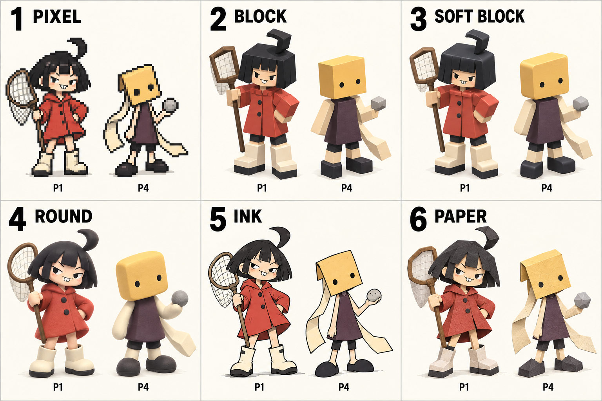

# P1·P4 표현 스타일 비교

2026-09-28. 사용자가 P1 우비 꼬마·P4 종이 가면 같은 플레이어를 선택하고 픽셀, 각진 블록, 모서리가 둥근 블록, 동글동글한 형태 및 다른 그림체를 비교해 달라고 요청했다.

| 번호 | 표현 방향 | 주요 차이 |
| --- | --- | --- |
| 1 | 픽셀 | 각진 픽셀 단위로 색과 실루엣을 구성 |
| 2 | 각진 블록 | 머리·몸통·팔다리의 평면과 직각 강조 |
| 3 | 둥근 모서리 블록 | 네모난 체형과 평면을 유지하고 모서리만 완화 |
| 4 | 둥근 인형 | 몸통·팔다리 자체가 부드러운 곡면 |
| 5 | 2D 잉크 카툰 | 굵은 선과 평면 색, 표정·자세 강조 |
| 6 | 종이 공예 | 접힌 면·오린 가장자리·종이 재질 강조 |

두 캐릭터의 정체성과 대표 색을 유지한 비교 시안이다. 기존 몬스터 6종의 콘셉트 승인은 유지한다. 최종 그림체는 사용자 선택 대기이며 게임 에셋은 교체하지 않았다.

내장 image_gen / imagegen 스킬로 생성했다. 3D처럼 보이는 후보도 현재는 이미지일 뿐 실제 모델·리깅이 아니다. 픽셀 후보도 제작용 스프라이트 시트가 아니다. 모바일 실제 크기와 움직임은 선택 후 별도 검증이 필요하다. 이번 작업은 문서·콘셉트 이미지 변경으로 git diff --check를 수행했으며 게임 검사를 재실행하지 않았다.

## 최종 생성 프롬프트

Use case: stylized-concept / style-transfer comparison. Make ONE polished, clearly readable art-style decision board for a mobile action game. Reference image contains four characters: USE ONLY P1 (top left: cheeky human girl with blunt black bob/cowlick, red raincoat, cream rain boots, butterfly net) AND P4 (bottom right: plain yellow rectangular paper-mask head with two black dot eyes, plum tunic, pale limbs, black shoes, blank trailing paper strip). Ignore P2 and P3 completely. Preserve the recognizable identity, colors and character personality of P1 and P4 in every panel. The user explicitly selected these identities and is now deciding STYLE and SHAPE LANGUAGE.

Landscape 3-column by 2-row comparison board with six equal spacious cells. Large numbered headings ONLY "1 PIXEL", "2 BLOCK", "3 SOFT BLOCK", "4 ROUND", "5 INK", "6 PAPER". Each cell contains the SAME TWO full-body characters side by side: P1 on left, P4 on right, similar overall height, same confident relaxed idle poses and same modest three-quarter slightly overhead viewing direction. Small labels P1 and P4 under the characters. No additional portraits or monsters. All six cells use identical completely uniform PALE IVORY BACKGROUND with subtle light-gray dividers; NO gradients, dark haze, vignette or atmospheric backdrop. Keep scale consistent across panels. Very clear differences between styles 2, 3, 4 are essential:

1 PIXEL: genuinely crisp low-resolution hand-authored 2D pixel sprite look with visible square pixels and nearest-neighbor hard edges. Roughly 48-to-64-pixel-high design enlarged uniformly, economical palette, no smoothing, no 3D voxels. Shorter mobile-friendly proportions, clear red coat and yellow rectangular mask. Retain P1 net and P4 trailing paper as simple readable pixel shapes.

2 BLOCK: original classic Roblox-like BLOCKY 3D humanoid visual language, rigid cuboid head/torso/arms/legs, sharp 90-degree corners, flat matte color faces and very simple face decals. P1 black bob as a few angular blocks, red raincoat interpreted as a red trapezoidal block coat, cream rectangular boots. P4 yellow box mask and plum cuboid tunic. Hard planar surfaces, ZERO beveling. Do not copy an existing branded avatar, no logos.

3 SOFT BLOCK: the EXACT SAME cuboid silhouette, proportions and block construction as style 2, but all cube edges have a clearly visible small rounded bevel. Mostly FLAT FACES remain obvious. Rounded rectangle head and limbs, lightly softened corners, matte low-poly toy look. Must stay recognizably block-shaped, NOT spheres or capsules. P4 yellow head is a softly beveled rectangular box.

4 ROUND: distinctly softer and rounder than style 3, squat plush/toy-like oval torso and capsule limbs, large simple head, pill-shaped boots, broad smooth curved surfaces, minimal detail. P1 red coat becomes a bell-like soft silhouette. P4 still unmistakably has a yellow rectangular mask, but heavily rounded pillow-like corners (do not turn mask into animal face). No shiny baby eyes, no glossy AI mascot finish; tiny confident eyes and restrained expression. Matte soft form.

5 INK: flat hand-drawn 2D indie cartoon, bold confident slightly irregular black outlines, expressive asymmetry, flat 3-color cel shading. Reference identity without detailed fabric texture, strong action-game silhouette, sharply readable features. P1 cheeky expression and P4 tilted paper-mask personality.

6 PAPER: layered colored cut-paper puppet / paper-craft miniature aesthetic, visible flat planes, deliberately angular folds and cut edges, subtle layered paper thickness, restrained paper texture. P1 red raincoat made of simple folded cut-paper pieces, P4 yellow folded mask naturally fits; articulated paper limbs and clear silhouettes. Less volumetric than 3D block styles.

Visual style board for character and art direction, NOT real game screenshots, NOT finished 3D models or sprite sheets. No weapons beyond P1's simple net, no costume redesign, no new accessories. Focus on how pixel density, hard corners, slight bevels, fully rounded forms, ink and paper change the same two characters. Strong craftsmanship and clarity, enough space around each pair.
